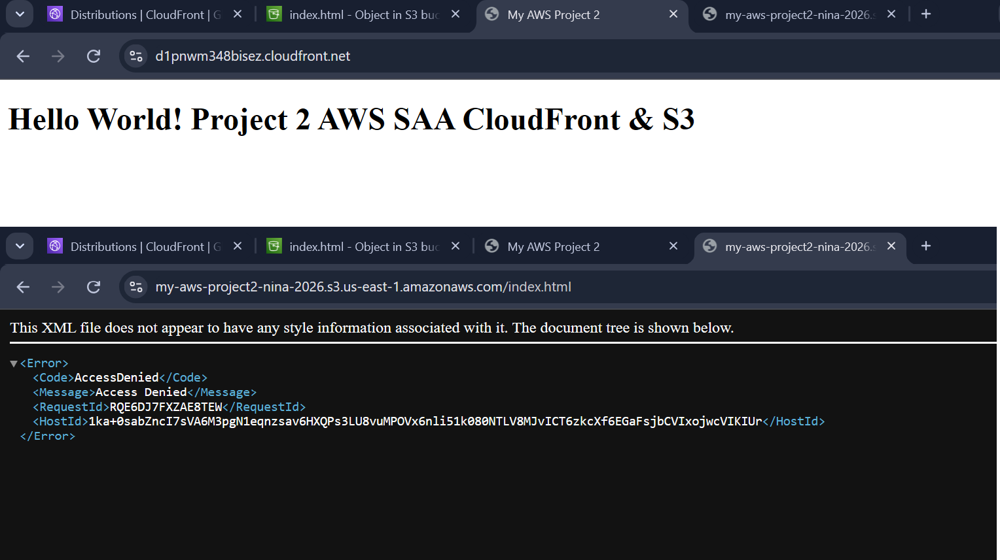
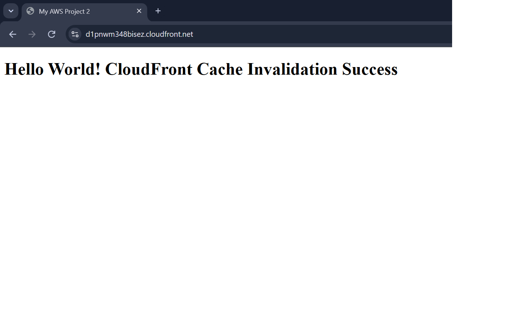

# AWS SAA Project: Secure Static Website Hosting with S3, CloudFront OAC & Cache Invalidation

## 📌 Project Overview
This project demonstrates an enterprise-grade, high-availability static website hosting architecture built on AWS following **AWS Certified Solutions Architect - Associate (SAA)** best practices. 

It leverages **Amazon S3** for origin storage, **Amazon CloudFront** as a global Content Delivery Network (CDN), **Origin Access Control (OAC)** for strict perimeter security, and **CloudFront Cache Invalidation** for seamless deployment updates.

---

## 🏗 Architecture & Tech Stack
* **Storage Layer:** AWS S3 (`my-aws-project2-nina-2026`) — Configured for private static asset hosting.
* **CDN & Edge Security:** AWS CloudFront with **Origin Access Control (OAC)** (`d1pnwm348bisez.cloudfront.net`) — Blocks direct S3 public access and enforces HTTPS traffic via AWS Edge Locations.
* **Content Lifecycle & Operations:** CloudFront Cache Invalidation (`/*`) — Automated edge cache purging for instant deployment sync.
* **Infrastructure as Code (IaC):** Terraform (`main.tf`) — Declarative infrastructure provisioning and version control.

---

## 📸 Proof of Implementation & Operational Verification

### 1. Zero-Trust Origin Security (CloudFront OAC Enforcement)
* **Access via CloudFront Distribution:** Content is securely delivered over TLS/HTTPS with low latency.
* **Direct S3 Access Attempt:** Direct public requests to the S3 bucket URL are denied (`403 AccessDenied`), proving that OAC policies are strictly enforced.



### 2. Edge Cache Management (Invalidation Verification)
* Successfully purged edge location caches using the invalidation pattern `/*`.
* Verified live content updates directly from the edge nodes without waiting for TTL expiration.



---

## 🛠 Infrastructure as Code (Terraform)
The included `main.tf` file automates the complete provisioning of this architecture.

```bash
# Initialize Terraform AWS provider
terraform init

# Review execution plan
terraform plan

# Provision S3 + CloudFront OAC infrastructure
terraform apply -auto-approve
---
```
## 🔑 Key Engineering Takeaways
* Implemented **Principle of Least Privilege (PoLP)** by removing public S3 bucket policies and delegating access exclusively to CloudFront OAC via SigV4 signing.
* Optimized global latency and operational efficiency through CDN caching and targeted invalidation strategies.
* Codified infrastructure with **Terraform** to support automated deployment workflows (IaC).

